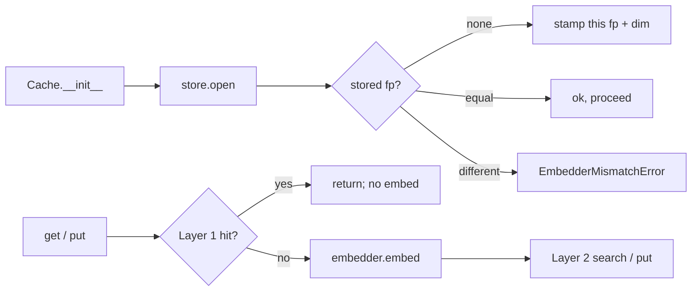

# Embedders

The cache does not bundle an embedder. You provide one against a small `Protocol`. This page documents the contract, the lifecycle, and the failure modes the cache cares about.

## Protocol

```python
class Embedder(Protocol):
    @property
    def dim(self) -> int: ...

    @property
    def fingerprint(self) -> str: ...

    def embed(self, text: str) -> npt.NDArray[np.float32]: ...
```

`AsyncEmbedder` is the same shape with `async def embed`. Either Protocol satisfies the cache; pick whichever matches your call site.

For runnable production-quality wrappers around OpenAI, sentence-transformers, AWS Bedrock, and Ollama see [Bring your own embedder](../getting-started/bring-your-own-embedder.md).

## Fingerprint: the load-bearing string

The `fingerprint` is the single most important piece of data your embedder advertises. It serves three jobs:

1. **Stamp on every cached entry.** Persisted in the store metadata.
2. **Validated on `cache.open()`.** A mismatch raises [`EmbedderMismatchError`](../reference/exceptions.md).
3. **Mark the dimension.** A change in dimension raises [`EmbedderDimensionError`](../reference/exceptions.md).

A good fingerprint encodes everything that would change the *meaning* of a vector:

- The model name (`text-embedding-3-small`, `all-MiniLM-L6-v2`, …).
- The dimension (relevant when the same model can output multiple sizes).
- Any preprocessing flag (instruction prefix, normalization on/off, language).

Examples:

```
openai:text-embedding-3-small:dim1536
openai:text-embedding-3-large:dim3072:half-precision
sentence-transformers:all-MiniLM-L6-v2:n1:dim384
bedrock:amazon.titan-embed-text-v2:0:dim1024:n1
ollama:nomic-embed-text:dim768
```

The cache treats this string as opaque - only equality matters. Make it deterministic: the same model under the same configuration must produce the same fingerprint across processes and across days.

## What happens when fingerprints disagree

```python
cache = SemanticCache(path="cache.db", embedder=OldEmbedder())
cache.put("hello", "world")
cache.close()

cache = SemanticCache(path="cache.db", embedder=NewEmbedder())  # different fingerprint
# raises EmbedderMismatchError("stored fp 'old:v1' does not match supplied 'new:v1'.
#                               Remediation: open with the original embedder, or use
#                               mneme.tools.migrate.reembed() to migrate.")
```

This is intentional. Mixing vectors from two different embedders gives garbage similarity scores: the cosine numbers come out fine but they don't *mean* the same thing. Better to fail loudly.

The [re-embed migration tool](../guides/reembed-migration.md) is the supported way to switch embedders: it walks every entry through the new embedder and writes a new cache, leaving the source untouched.

## Embedder lifecycle in the cache



The embedder is called only on Layer-2 paths and on `put`. Layer-1 hits never touch it. This is why a hash-pre-check matters: it avoids the embedder cost entirely for trivial duplicates.

## Sync vs async

The cache class you instantiate (`SemanticCache` or `AsyncSemanticCache`) **must match the embedder's flavor**:

| Cache | Embedder Protocol expected |
| --- | --- |
| `SemanticCache` | `Embedder` (sync `embed`) |
| `AsyncSemanticCache` | `AsyncEmbedder` (`async embed`) |

Mismatch produces a confusing runtime error (the cache calls `embed()` and gets a coroutine instead of a vector). Use the [adapter helpers](../reference/types.md#mneme._embedder_adapters.to_async_embedder):

```python
from mneme import to_async_embedder, to_sync_embedder

async_compatible = to_async_embedder(my_sync_embedder)
sync_compatible = to_sync_embedder(my_async_embedder)
```

`to_async_embedder` wraps the sync `embed()` with `asyncio.to_thread` - usually fine; thread overhead is small compared to most embedding work.

`to_sync_embedder` runs an event-loop spin per `embed` - more expensive. Prefer the async cache when the underlying embedder is async.

## Failure handling

The cache treats embedder failures as soft when the user can recover (`get`) and hard when they can't (`put`):

| Operation | Embedder fails | Cache behavior |
| --- | --- | --- |
| `get(query)` | exception in `embed()` | Layer-2 path returns `None` (treated as miss). A `WARNING` is logged. The metrics hook fires with `reason="embedder_failure"`. |
| `put(query, response)` | exception in `embed()` | The exception propagates. You wanted to cache and couldn't. |
| `get(query, embedding=v)` | n/a | embedding is supplied directly; embedder is not called. |
| `put(query, response, embedding=v)` | n/a | same. |

The `embedding=` parameter on `get`/`put` lets you sidestep the embedder entirely, e.g. when you've embedded once outside the cache and want to reuse the vector for both call sites.

## Picking a model

[The "Picking a model dimension" section in BYOE](../getting-started/bring-your-own-embedder.md#picking-a-model-dimension) covers the trade-offs. Short version:

- 384–768 dim is enough for short-query intent classification or paraphrase detection. `all-MiniLM-L6-v2` is the perennial cheap option.
- 1024+ dim helps for long-context semantic search but costs proportionally more memory + bandwidth.
- Use [int8 quantization](quantization.md) to cut memory 4× when you must run a high-dim model.

## Where to go next

- **[Bring your own embedder](../getting-started/bring-your-own-embedder.md)** - code for OpenAI, sentence-transformers, Bedrock, Ollama.
- **[Re-embed migration](../guides/reembed-migration.md)** - switching embedders without losing the cache.
- **[Calibration](../guides/calibration.md)** - picking a threshold matched to *your* embedder.
- **[Quantization](quantization.md)** - fp32 vs fp16 vs int8 for the in-memory matrix.
