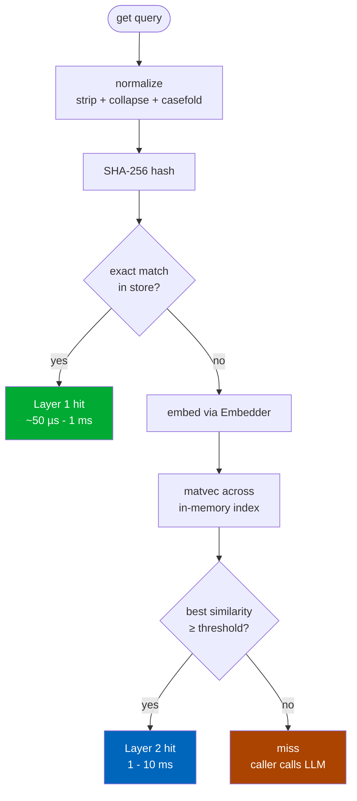

# Layered cache

`mneme` is two caches stacked. Every `get()` first tries an O(1) exact-match lookup; only if that misses does it embed the query and run a similarity search.



## Layer 1: exact match

The query is normalized:

1. Strip leading/trailing whitespace.
2. Collapse internal whitespace runs to single spaces.
3. Casefold (Unicode-aware lowercasing).

Then SHA-256 hashed. The store does an O(1) lookup on `(namespace, query_hash)` - usually a primary-key or unique-index hit.

This catches all the trivial duplication: the same user phrasing the same question twice, the same canned form being submitted repeatedly, etc. It's free in latency and accuracy. There are no false positives - only literal duplicates (after normalization) hit Layer 1.

`mneme` returns `Hit(layer="exact", similarity=1.0, ...)` for these.

## Layer 2: semantic match

If Layer 1 misses, the cache embeds the query and asks the in-memory index for the top-k closest cached vectors. Cosine similarity is used; vectors are L2-normalized so cosine is just a dot product.

If the best match scores **at or above** `similarity_threshold` (default `0.85`), it's a Layer 2 hit. Otherwise: miss.

```python
hit = cache.get("How do I cancel?")
if hit and hit.layer == "semantic":
    print(f"matched cached entry at similarity {hit.similarity:.3f}")
```

The threshold is the central knob. Too high → many useful paraphrases are misses. Too low → unrelated queries collide. Calibrate it against your own corpus. See [Calibration](../guides/calibration.md).

## What happens on a miss

A miss returns `None`. The caller is expected to compute the answer (typically an LLM call) and `cache.put()` the result. The next paraphrase of the same intent is then a Layer 2 hit.

```python
hit = cache.get(query)
if hit is None:
    response = call_llm(query)
    cache.put(query, response)
else:
    response = hit.response
```

This is the canonical pattern. See [Your first cached LLM](../getting-started/your-first-cached-llm.md).

## Why two layers

Layer 2 alone would work - every query would be embedded and matched. But:

- **Embedding has cost.** Even a fast local model is 1–5 ms per embed; an OpenAI call is 100+ ms. Layer 1 short-circuits the whole pipeline for trivial duplicates.
- **Hash collisions are predictable.** SHA-256 on a normalized query is deterministic; if two strings normalize to the same hash, they really are the same query.
- **Most production traffic is paraphrase-poor.** Real chatbot logs show 30–60% of queries are *exact* duplicates after normalization, before any semantic logic kicks in. Skipping the embed for those queries is a big throughput win.

Layer 1 is conservative; Layer 2 is permissive. Together they cover the realistic distribution of duplicate-ish queries with the right cost trade-off at each level.

## Hit object

Every cache hit returns a [`Hit`](../reference/types.md):

```python
@dataclass(frozen=True, slots=True)
class Hit:
    response: str
    similarity: float          # 1.0 for exact; the cosine score for semantic
    confidence: float          # weighted by age, validator, custom fn
    age_seconds: int           # how long ago the entry was inserted
    layer: HitLayer            # "exact" or "semantic"
    namespace: str
    metadata: dict[str, Any]   # whatever you put on insert
```

The `confidence` lets you decide whether to *trust* a hit. Default is a 24-hour half-life - confidence drops by half every day since insert. Pass your own `confidence_fn=` to `SemanticCache(...)` if you want different decay or your own scoring. See [Confidence and validators](confidence-and-validators.md).

## Updating an entry

Calling `cache.put()` with a query that already exists in the cache (same namespace + same normalized hash) **replaces** the existing entry. The new vector + response + metadata override; the row id stays the same.

```python
cache.put("how do I cancel", "Settings → Subscription → Cancel")
# ... time passes, you change the answer ...
cache.put("how do I cancel", "Account → Manage Plan → End Subscription")

hit = cache.get("how do I cancel")
assert hit.response == "Account → Manage Plan → End Subscription"
```

This is the desired behavior for keeping cached LLM answers fresh: re-`put` with the same query and the new response is what subsequent paraphrases get back.

## Bypassing the cache

For testing or debugging:

```python
hit = cache.get(query, bypass=True)        # forces a miss; useful in A/B comparisons
```

The showcase's "Same query, no cache" button uses this to side-by-side time a cached vs non-cached call.

## Where to go next

- **[Embedders](embedders.md)** - Layer 2 only works as well as your embedder.
- **[Multi-tenant](multi-tenant.md)** - Layer 2 search is namespace-scoped.
- **[Calibration](../guides/calibration.md)** - pick the right `similarity_threshold`.
- **[Performance tuning](../guides/performance-tuning.md)** - Layer 2 latency at scale.
