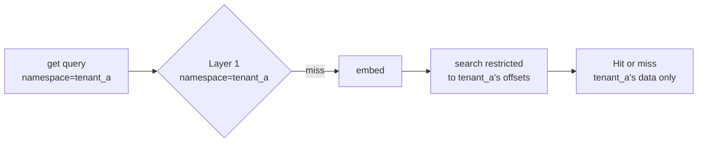

# Multi-tenant

`mneme` ships namespaces and per-namespace LRU quotas as first-class features. One cache file can serve many tenants safely without leaking cached answers between them.

## The model

Every `get` and `put` takes an optional `namespace=` (default: `"default"`):

```python
cache.put("how do I cancel?", "tenant_a's answer", namespace="tenant_a")
cache.put("how do I cancel?", "tenant_b's answer", namespace="tenant_b")

a = cache.get("how do I cancel?", namespace="tenant_a")
b = cache.get("how do I cancel?", namespace="tenant_b")

assert a.response == "tenant_a's answer"
assert b.response == "tenant_b's answer"
```

The two entries are completely separate. The `query_hash` may be identical (it's the same string) but the `(namespace, query_hash)` tuple is unique.

## Layer 2 search is namespace-scoped

Semantic matching searches **only** the requested namespace's vectors. A paraphrase from tenant_a cannot accidentally hit tenant_b's cache. Internally, each namespace has its own offset list into the shared in-memory matrix; the search filters to that list before the matvec.



Tenant_b's vectors are physically present in the matrix but invisible to a tenant_a query.

## Per-namespace LRU quotas

Constructor accepts a `namespace_quotas` map. Each entry is a hard cap on `(entries in that namespace)`. When the cap would be exceeded by a `put`, the oldest entries in *that namespace* are evicted — not other namespaces.

```python
cache = SemanticCache(
    path="cache.db",
    embedder=embedder,
    namespace_quotas={
        "tenant_a": 1_000,    # tenant_a is on the small plan
        "tenant_b": 50_000,   # tenant_b is on a larger plan
    },
)
```

When `tenant_a` writes its 1001st entry, **tenant_a's** oldest entry is evicted. `tenant_b` is unaffected.

A namespace not listed in `namespace_quotas` has no per-namespace cap. The global `max_entries=` cap (also a constructor parameter) still applies.

## Eviction order

Within a namespace under quota pressure, eviction is **least-recently-used by `last_used_unix`** — the last `get` or `put` timestamp. Caller can override the eviction policy by holding their own LRU state outside the cache; see [Performance tuning](../guides/performance-tuning.md).

Eviction batches are 10% of the namespace's cap (min 1) per `put` that breaches the cap, so a single overflow doesn't trigger a single-row delete loop. For cap=1000, ~100 entries are evicted per overflowing put.

## Listing and clearing

```python
cache.list_namespaces()                  # ['default', 'tenant_a', 'tenant_b']
cache.clear_namespace("tenant_a")        # wipes only tenant_a; returns count
cache.clear()                            # wipes everything across all namespaces
```

`stats(namespace="tenant_a")` returns counters scoped to that namespace; without a namespace it's the aggregate.

## Common patterns

### Per-customer cache

Use the customer ID directly as the namespace.

```python
namespace = f"customer:{customer.id}"
hit = cache.get(query, namespace=namespace)
```

If you have many customers (10k+), the per-namespace offset arrays start adding overhead. Past ~10k namespaces, prefer a separate cache file per high-volume tenant or a network store with a sharded key prefix.

### Per-environment

Test/staging/prod sharing one cache file:

```python
cache.put(query, response, namespace=os.environ["DEPLOY_ENV"])
```

Useful when you want production traffic to repopulate the cache while test traffic stays out of the production hit space.

### Per-LLM-version

When you A/B test two LLM prompts or two LLM models:

```python
namespace = f"llm:{prompt_version}"
```

Cached answers from prompt v1 don't bleed into the v2 evaluation. When v2 wins, `cache.clear_namespace("llm:v1")` reclaims the space.

### Per-language

```python
namespace = f"lang:{request.language}"
```

A French paraphrase of an English query won't hit the English cached answer, even if their embeddings happen to be close. (For multilingual embedders, this is a soft guard; you'd still want a multilingual model that distinguishes "How do I cancel?" from "Comment puis-je annuler?")

## What namespaces are not

- **Not access control.** A bug that calls `cache.get(query, namespace="anything")` reads any namespace. Treat namespaces as data partitioning, not authorization. Authorization happens before you reach into the cache.
- **Not encryption.** Vectors and responses are stored verbatim. Don't put cleartext PII in a multi-tenant cache where an operator can `iter_all` against the store.
- **Not isolation across hosts.** Two processes against the same store see the same namespaces. Cross-host tenant isolation needs a per-tenant store (separate Redis prefix, separate Postgres schema, separate DynamoDB table).

## Where to go next

- **[Custom stores](../guides/custom-stores.md)** — extending namespace semantics in your own backend.
- **[Per-namespace metrics](../guides/metrics.md)** — observability scoped to a tenant.
- **[Showcase / Multi-tenant page](../showcase.md)** — see namespace isolation live in the demo.
