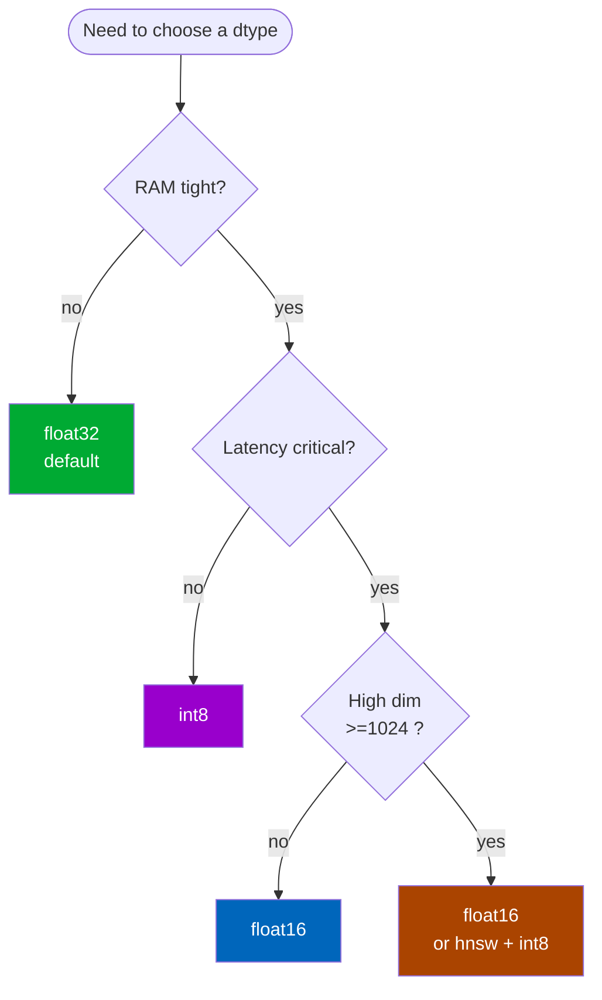

# Quantization

`mneme` always **persists** vectors as `float32`. The in-memory index can use a smaller dtype — `float16` or `int8` — for less memory at the cost of some search-time work. Pick with `vector_dtype=` when you instantiate the cache:

```python
SemanticCache(..., vector_dtype="float16")    # default is "float32"
```

## What changes between dtypes

| dtype | bytes/element | 100k × d=1536 matrix | Cosine accuracy | Search latency |
| --- | --- | --- | --- | --- |
| `float32` (default) | 4 | 614 MB | exact | fastest |
| `float16` | 2 | 307 MB | ~0.1% drift on typical embeddings | slightly slower (cast each search) |
| `int8` | 1 | 154 MB | 1–3% drift on typical embeddings | slower at high d (no fused int8 GEMM in NumPy) |

The store on disk is always `float32` regardless. Quantization is purely an in-memory optimization, applied once when the index is built. You can switch dtypes between runs without rebuilding the store.

## Picking one



- **`float32`**: the default. Use when memory is plentiful. Cleanest; no cast on every search; smallest accuracy drift (zero).
- **`float16`**: 2× memory cut for negligible accuracy loss. The cast on every search adds a few milliseconds at 100k × 1536 but matvec is BLAS-fast on the result. Best general-purpose memory optimization.
- **`int8`**: 4× memory cut. Symmetric quantization with implicit scale 127, assumes L2-normalized input. Search latency on pure NumPy at high dim is bandwidth-bound (~50 ms at 100k × 1536) because the `int8 → float32` cast dominates. The win is **memory footprint**, not speed. Calibrate the similarity threshold against int8 vectors if that's your prod dtype — cosine scores shift slightly.

If you need both small footprint *and* low latency at scale, pair `int8` with `index_backend="hnsw"`. hnswlib's approximate-NN search avoids the full matrix scan; the int8 cast cost mostly disappears.

## Calibration matters more with int8

`int8` quantization shifts cosine scores by 1–3% on most embeddings. A threshold of `0.78` on fp32 might land at `0.76` on int8 for the same paraphrase pair. **Calibrate against the dtype you'll run in production**:

```python
from mneme.tools.calibrate import find_threshold

# This explicitly evaluates with int8-quantized vectors:
result = find_threshold(
    paraphrase_pairs=...,
    distractor_pairs=...,
    embedder=...,
    vector_dtype="int8",   # ← match prod
    target_metric="f1",
)
```

If you skip this step and copy a threshold from an fp32 calibration, you'll see slightly more misses (or false positives, depending on the drift direction) when you switch to int8. See [Calibration](../guides/calibration.md).

## Switching dtypes at runtime

`cache.requantize(dtype)` rebuilds the in-memory matrix at a new dtype without touching the store:

```python
cache = SemanticCache(path="cache.db", embedder=embedder, vector_dtype="float32")
# ... cache fills up ...
cache.requantize("int8")    # 4x memory cut, instant
```

Lossy when going **down** (fp32 → int8 throws away precision). For a precision-preserving upgrade (int8 → fp32), the cache reads the float32 source-of-truth from the store, so re-quantizing back to fp32 gives you the original vectors verbatim.

## Memory math

Approximate in-memory matrix size: `n × d × bytes-per-element`.

For 100k entries:

| d | float32 | float16 | int8 |
| --- | --- | --- | --- |
| 384 | 154 MB | 77 MB | 38 MB |
| 768 | 307 MB | 154 MB | 77 MB |
| 1024 | 410 MB | 205 MB | 102 MB |
| 1536 | 614 MB | 307 MB | 154 MB |
| 3072 | 1.2 GB | 614 MB | 307 MB |

Multiply by 1.05–1.1 for index bookkeeping (offset arrays, namespace maps, tombstones). For 1M entries scale 10×.

`SemanticCache.stats().memory_bytes_estimate` reports the current matrix size live; the showcase dashboard surfaces it in the entry counter.

## Where to go next

- **[Calibration](../guides/calibration.md)** — calibrate against your chosen dtype.
- **[Performance tuning](../guides/performance-tuning.md)** — how dtype interacts with hnsw and chunked matvec.
- **[Performance baseline](../performance.md)** — measured latencies by dtype.
