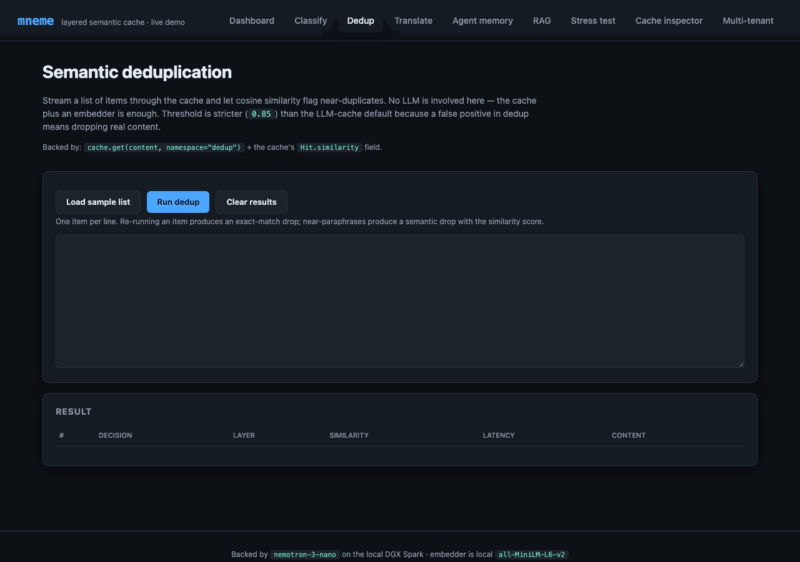
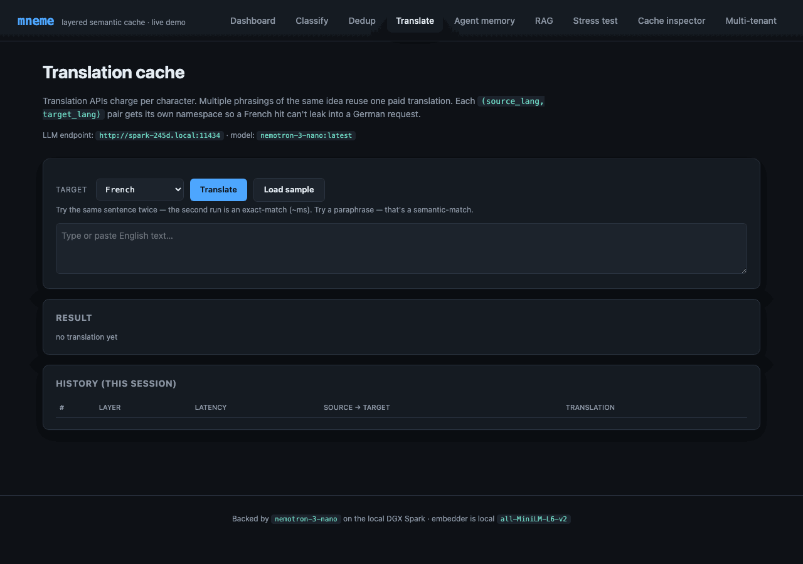
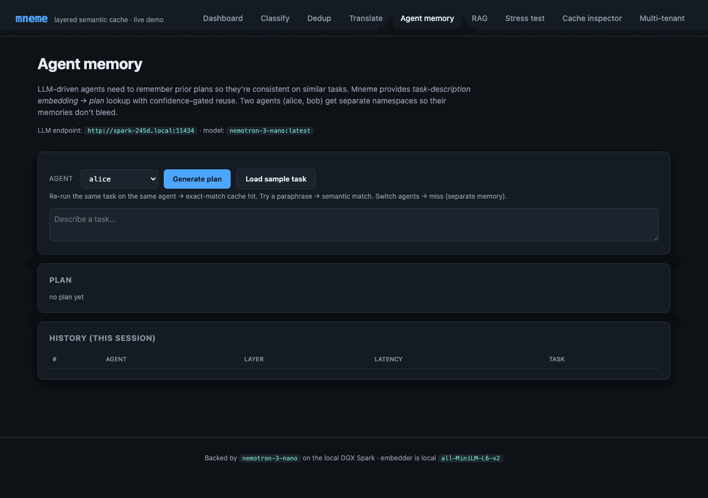
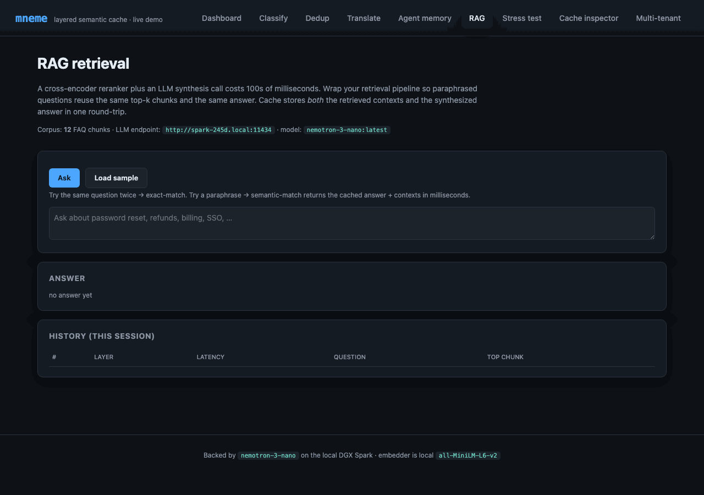

# Showcase

A self-contained Flask app that demonstrates every one of `mneme`'s [use cases](use-cases.md) against a real LLM running on a [DGX Spark](https://www.nvidia.com/en-us/products/workstations/dgx-spark/) (or any Ollama-compatible host). The classification page is the marquee demo — paraphrases hitting cache instead of `nemotron-3-nano` is the kind of thing that lands in seconds — but the same Flask app also exposes Dedup, Translate, Agent memory, and RAG retrieval pages, each backed by the same `SemanticCache` and demonstrating its specific pattern.

The pitch in one sentence: an LLM call is slow and expensive on every input; this app makes that obvious across five different pattern types, then makes it disappear by wrapping each call in `mneme.SemanticCache`.

The full project lives at [`examples/showcase/`](https://github.com/anthonynystrom/mneme/tree/main/examples/showcase).

## What's in the demo

| Page | Pattern | Cache key | Cache value |
|---|---|---|---|
| **Classify** | Intent classification | message text | one of 7 intents |
| **Dedup** | Semantic deduplication | content text | sentinel ``"seen"``; reads `Hit.similarity` directly |
| **Translate** | Translation cache | source text + target lang (one namespace per pair) | translated text |
| **Agent memory** | Per-agent task→plan | task description + agent_id (one namespace per agent) | execution plan |
| **RAG** | RAG retrieval | question | JSON bundle of `(answer, contexts, chunk_ids)` |
| **Stress test** | (operational) bulk classification | — | — |
| **Cache inspector** | (operational) raw entry view | — | — |
| **Multi-tenant** | (operational) namespace quotas | — | — |
| **Dashboard** | (operational) live stats + maintenance | — | — |

Each page demonstrates a slightly different shape of the same library — read [`examples/showcase/use_cases.py`](https://github.com/anthonynystrom/mneme/blob/main/examples/showcase/use_cases.py) for the wrappers (`Deduplicator`, `CachedTranslator`, `CachedAgent`, `CachedRAG`). They're under 150 lines combined; the patterns are short.

## The pages

The dashboard and the five use-case pages cover the library's capabilities; three operational pages (Stress, Inspector, Multi-tenant) demonstrate workflows around it.

### Dashboard - live counters and maintenance


Polls `/api/stats` once a second. Surfaces every meaningful piece of state:

- **LLM-seconds saved** - the headline number; this is *why mneme exists* in one stat.
- **Cache hit rate** - climbs as paraphrases land on cached entries.
- **Cached entries** - total entry count, plus the actual matrix bytes (`Stats.index_memory_bytes`) and tombstone count (`Stats.index_tombstone_count`) so you can spot RAM drift.
- **Layer breakdown** - exact-match vs semantic-match vs miss counts.
- **Per-namespace breakdown** - proves the multi-tenant story (each tenant's traffic isolated).
- **Recent queries** - a ring buffer of the last 50, color-coded by layer (green=exact, blue=semantic, orange=miss).
- **Similarity threshold slider** - adjusts the cache's runtime knob from the UI. Drag it left, more queries become semantic hits; drag right, fewer hits but tighter precision. Calls `cache.set_similarity_threshold(value)` debounced at 150 ms while dragging.
- **Compact button** (Maintenance card) - calls `cache.compact()` to reclaim tombstoned matrix rows; reports reclaimed count.
- **Clear cache** (Danger zone) - namespace-scoped via the dropdown: pick "All namespaces" for `cache.clear()`, or pick a specific tenant for `cache.clear_namespace(ns)`.

### Classify - single-query intent classification


Submit one query at a time and see the cache decide. The right column shows the same query with the cache **bypassed** - same model, same prompt, every time - for direct wall-clock timing comparison.

The narrative arc:

1. Click "**How do I reset my password?**" preset → submit. Status: `miss`. Latency: ~500 ms (the LLM ran). Intent: `how_to`.
2. Submit the same query again. Status: `exact`. Latency: ~0.2 ms. Same intent.
3. Submit "**I forgot my password, what now?**". Status: `semantic`. Similarity: ~0.79. Latency: ~25 ms. Same intent.
4. Click "**Same query, no cache**". Status: `miss`. Latency: ~500 ms again. The cache didn't lift a finger this time - that's the cost you'd pay on every request without mneme.

Step 3 is the moment the demo earns its keep.

### Dedup - semantic deduplication, no LLM



Different shape from the LLM cache: read `Hit.similarity`, ignore `Hit.response`. The cache becomes a "have I seen something this close before?" detector. Threshold is stricter (0.85) than the LLM-cache default because false positives drop real content.

Paste a list, hit Run. The results table tags each row as KEEP (novel) or DROP (near-duplicate of a prior row), with the similarity score. The "Load sample" button populates a small set with deliberate paraphrase pairs so you can see the layer behavior — same string twice → exact-match drop; rephrased string → semantic-match drop with the score; unrelated string → KEEP.

Backed by [`Deduplicator`](https://github.com/anthonynystrom/mneme/blob/main/examples/showcase/use_cases.py) — under 30 lines.

### Translate - per-language-pair caching



Each `(source, target)` pair gets its own namespace (`translate:en-fr`, `translate:en-es`, …) so a French hit can't leak into a German request. Translation comes from Nemotron with a "translate this exactly" system prompt.

Try it: translate the same sentence twice → exact-match (~ms). Pick a different target language → miss for the new pair, exact-match for the original pair. Paraphrase the source → semantic-match against the prior translation; the LLM is not called.

Backed by [`CachedTranslator`](https://github.com/anthonynystrom/mneme/blob/main/examples/showcase/use_cases.py).

### Agent memory - per-agent task→plan with confidence gate



LLM agents need memory of prior decisions for consistency. mneme provides task-embedding → plan lookup, with a `confidence >= 0.7` gate so degraded similarity doesn't pull in stale plans. Per-agent namespace (`agent:alice`, `agent:bob`) keeps memories isolated.

Try it: generate a plan for alice. Re-run the same task as alice → exact-match cache hit. Switch to bob → miss (separate memory). Paraphrase alice's task → semantic-match with confidence-gated reuse.

Backed by [`CachedAgent`](https://github.com/anthonynystrom/mneme/blob/main/examples/showcase/use_cases.py).

### RAG - retrieval cache with synthesized answer



A single cached entry stores the entire RAG bundle: the synthesized answer, the top-k retrieved chunks, and their IDs as a JSON-encoded payload. So a paraphrased question reuses both the retrieval *and* the synthesis in one shot — milliseconds instead of hundreds of ms (retrieval) plus seconds (LLM synthesis).

Corpus is 12 customer-support FAQ chunks shipped in [`use_cases.py`](https://github.com/anthonynystrom/mneme/blob/main/examples/showcase/use_cases.py). Top-3 retrieval over cosine similarity against the same `all-MiniLM-L6-v2` embedder. Synthesis from Nemotron with a strict "use only the context" system prompt and `[1]/[2]/[3]` source citations.

Try it: ask about password reset. First call: ~1–2 s (retrieval + Nemotron). Re-ask same question → exact-match (~ms). Paraphrase ("How do I change my password?") → semantic-match returns the same bundle.

Backed by [`CachedRAG`](https://github.com/anthonynystrom/mneme/blob/main/examples/showcase/use_cases.py).

### Stress test - cumulative hit-rate live


Click "**Run 73 queries**" and the page streams Server-Sent Events, one per classification. The Chart.js line on the left tracks the **cumulative cache hit rate** climbing from 0% on a cold start to 30–40% by the end of the run; the live tail on the right shows the most recent classifications with their layer badges.

Why this works as a demo: the corpus has deliberate paraphrase clusters (see [`seed_data.py`](https://github.com/anthonynystrom/mneme/blob/main/examples/showcase/seed_data.py)). The first query in each cluster misses (LLM call); subsequent paraphrases hit Layer 2. As the run progresses, hits start landing in real time. The chart shows the cache *learning the corpus* in front of you.

The full run takes ~40 seconds - most of that wall time is the first query of each of the 7 intent clusters paying the full LLM tax.

### Cache inspector - what's actually in there


A paginated table of every entry in the cache. Filter by namespace, search by substring. Confirms two things:

- **Persistence is real.** Stop the Flask app, restart it, refresh this page - the entries are still here. SQLite is the durable backing.
- **The cache is not magic.** Just (namespace, query, response, age) tuples. The "intent" column is whatever the LLM returned, cached verbatim.

The hits column shows how many times each entry has been served - useful for understanding which queries dominate your workload.

### Multi-tenant - namespace isolation in action


Click **tenant_a** twice, then **tenant_b** twice, and watch:

1. tenant_a 1st run - 6 misses (LLM calls). Every layer column says `miss`.
2. tenant_a 2nd run - 6 hits. Mostly `exact`, some `semantic` if the queries vary slightly.
3. tenant_b 1st run - 6 misses again, **even though tenant_a already learned the same queries**. Namespaces are isolated.
4. tenant_b 2nd run - 6 hits. Both tenants now warm.

The dashboard's per-namespace breakdown table updates live during each run; you can flip between tabs and watch the counters move.

This is the multi-tenancy story made concrete: same cache, same embedder, same LLM, same queries - but tenant_a's hit history doesn't leak into tenant_b's request path.

## What's running under the hood

- **LLM**: `nemotron-3-nano` (31.6 B Nemotron-H-MoE, Q4_K_M) served by Ollama. The default config points at `http://localhost:11434`; override with `MNEME_SHOWCASE_SPARK_URL=http://your-host:11434` to point at a remote box (e.g. a DGX Spark on your LAN). Cold call ~4 s (model load); warm ~0.5 s.
- **Embedder**: `sentence-transformers/all-MiniLM-L6-v2` (384-dim) running locally on CPU, ~80 MB memory.
- **Cache**: `SemanticCache` against SQLite at `examples/showcase/cache.db`. `vector_dtype="float16"`. Threshold calibrated to 0.65 against the seed corpus.
- **Web**: Flask 3 in `app.run(threaded=True)`. No external services beyond the LLM host; no auth.

Every public `mneme` API is exercised somewhere in the app. The cache wrappers live in [`use_cases.py`](https://github.com/anthonynystrom/mneme/blob/main/examples/showcase/use_cases.py) (under 250 lines covering all four secondary patterns). `app.py` adds the routes around them and shows: `SemanticCache.__init__`, `get` (including `bypass=True`), `put`, `delete`, `stats`, `list_namespaces`, `clear`, `clear_namespace`, `compact`, `vacuum`, `set_similarity_threshold`, plus the `Hit` / `Stats` dataclasses and namespace-scoped operations. If you want to copy a pattern into your own service, start in `use_cases.py`.

## Running it

```bash
git clone https://github.com/anthonynystrom/mneme.git
cd mneme/examples/showcase

python -m venv .venv
source .venv/bin/activate

pip install -r requirements.txt
pip install -e ../..                             # editable install of mneme

# Sanity-check the LLM host (defaults to localhost; set MNEME_SHOWCASE_SPARK_URL
# to a remote host like http://your-spark.local:11434 if Ollama isn't local).
curl -fsS "${MNEME_SHOWCASE_SPARK_URL:-http://localhost:11434}/api/tags"

python app.py
```

Open <http://127.0.0.1:5001>. The dashboard renders immediately; first classification takes a few hundred extra ms while the embedder warms.

## Configuration

Everything lives in [`config.py`](https://github.com/anthonynystrom/mneme/blob/main/examples/showcase/config.py) and accepts `MNEME_SHOWCASE_*` env-var overrides:

| Variable | Default | Notes |
| --- | --- | --- |
| `MNEME_SHOWCASE_SPARK_URL` | `http://localhost:11434` | Ollama host (override to point at a remote DGX/server) |
| `MNEME_SHOWCASE_MODEL` | `nemotron-3-nano:latest` | Any Ollama model that follows JSON-format instructions |
| `MNEME_SHOWCASE_LLM_TIMEOUT` | `60` | Seconds |
| `MNEME_SHOWCASE_EMBEDDER` | `sentence-transformers/all-MiniLM-L6-v2` | Local embedder |
| `MNEME_SHOWCASE_SIM_THRESHOLD` | `0.65` | Calibrated; tweak via the dashboard slider too |
| `MNEME_SHOWCASE_DTYPE` | `float16` | `float32`, `float16`, or `int8` |
| `MNEME_SHOWCASE_PORT` | `5001` | macOS uses 5000 for AirPlay Receiver |

## What this is not

- **Not a library.** The showcase is a demo, not part of the installed `mneme` wheel. It lives in `examples/showcase/` and ships its own `requirements.txt`.
- **Not production code.** No auth, no TLS, no WSGI server. It's `app.run()` for clarity. Don't expose it on the open internet.
- **Not the only way to use mneme.** It's *one* shape - Flask in front of an LLM. Most production users wrap the cache around the LLM call inside their own service. See [Your first cached LLM](getting-started/your-first-cached-llm.md).

## Code layout

```
examples/showcase/
  README.md                 # quickstart + troubleshooting
  requirements.txt          # Flask, sentence-transformers, requests, numpy
  config.py                 # central config + env var overrides
  app.py                    # Flask routes + AppState (~600 lines)
  classifier.py             # CachedClassifier wrapping the LLM
  use_cases.py              # Deduplicator, CachedTranslator, CachedAgent, CachedRAG + RAG corpus
  nemotron_client.py        # Ollama HTTP client (classify + translate + plan + RAG synthesis)
  embedder.py               # SentenceTransformersEmbedder
  seed_data.py              # 73 labeled paraphrases across 7 intents
  calibrate.py              # threshold tuning script
  templates/                # 9 pages: dashboard + 5 use cases + 3 operational
  static/                   # style.css + app.js
```

## Where to go next

- **[Use cases](use-cases.md)** - five patterns, including runnable examples for the ones not covered by this UI.
- **[Your first cached LLM](getting-started/your-first-cached-llm.md)** - the same caching pattern, without the demo wrapping.
- **[Multi-tenant](concepts/multi-tenant.md)** - what the namespace switcher demonstrates.
- **[Performance baseline](performance.md)** - the numbers behind the "saved seconds" counter.
