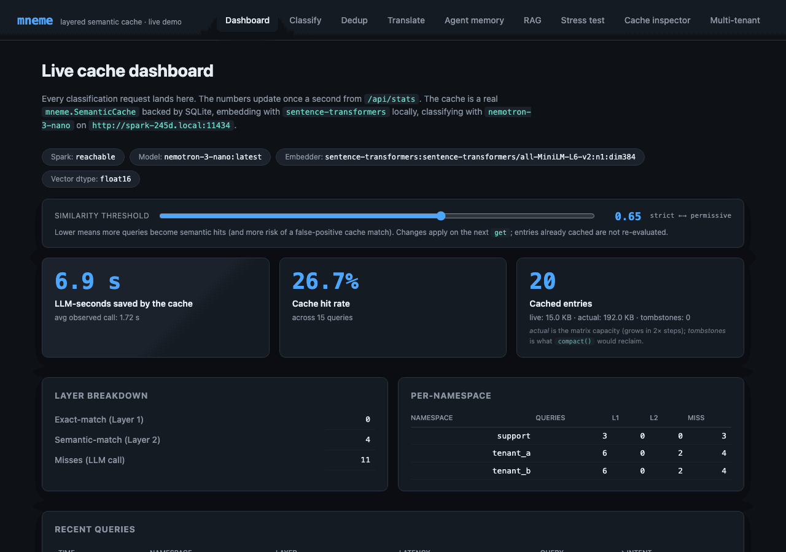
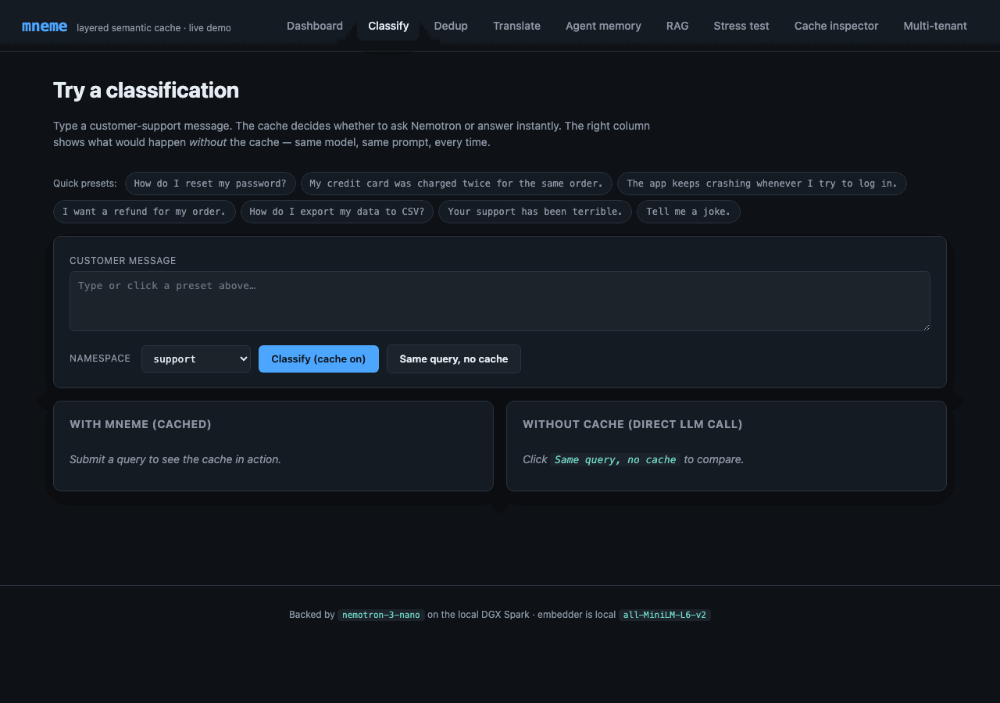
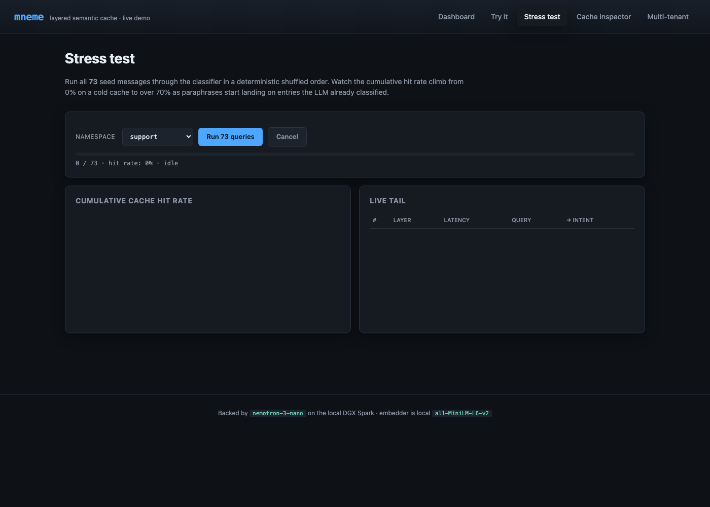
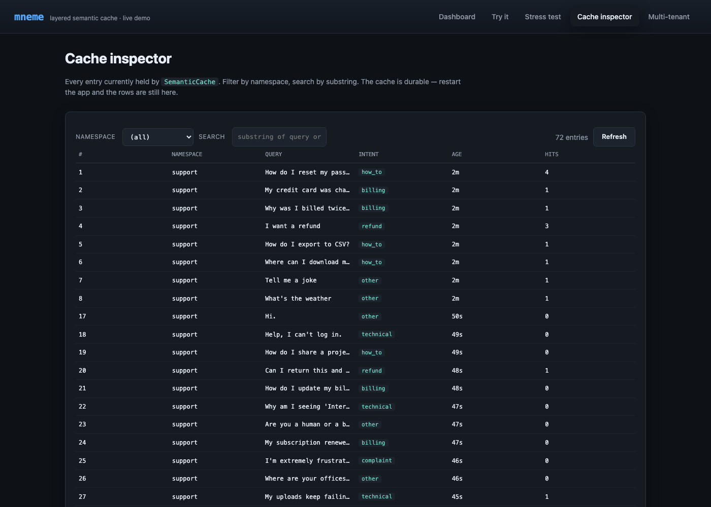
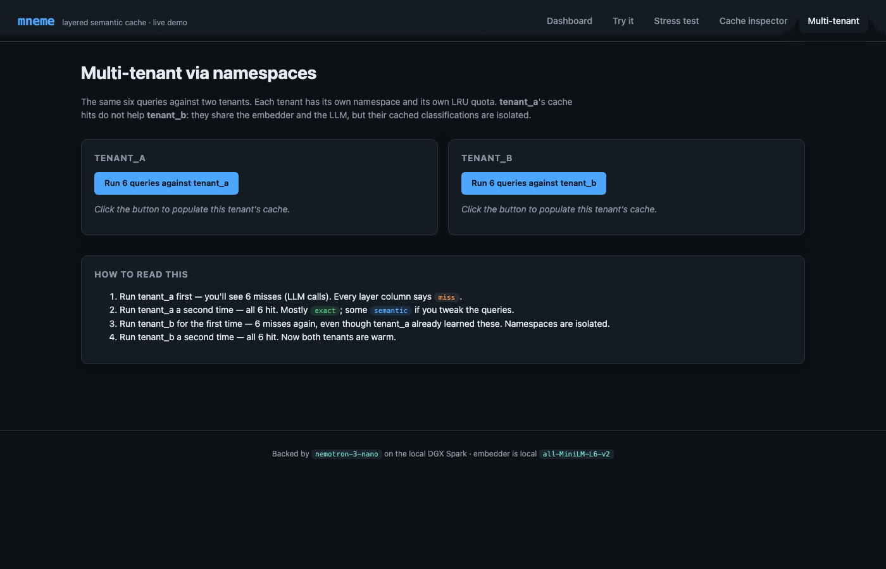

# Showcase

A self-contained Flask app that classifies customer-support messages into 7 intents using `nemotron-3-nano` running on a [DGX Spark](https://www.nvidia.com/en-us/products/workstations/dgx-spark/) (or any Ollama-compatible host) - and shows what `mneme` does for an LLM workload that has paraphrases.

The pitch in one sentence: an intent classifier talking to a real LLM is slow and expensive on every call; this app makes that obvious in five pages, then makes it disappear by wrapping the call in `mneme.SemanticCache`.

The full project lives at [`examples/showcase/`](https://github.com/anthonynystrom/mneme/tree/main/examples/showcase).

## Why a Flask app

The showcase covers exactly *one* of the [use cases](use-cases.md) - pattern #4, classification result caching - and it does so visually because that's where the cache's behavior is most surprising to a viewer. Watching the latency drop from 500 ms to <1 ms when you submit a paraphrase is the kind of thing that lands in seconds.

For the other patterns (RAG retrieval, translation, dedup, agent memory) the killer moment is `print(result)`, not a UI. Those have small focused scripts under [`examples/use-cases/`](use-cases.md#runnable-examples) instead.

## The five pages, in order

### Dashboard - live counters



Polls `/api/stats` once a second. Surfaces every meaningful piece of state:

- **LLM-seconds saved** - the headline number; this is *why mneme exists* in one stat.
- **Cache hit rate** - climbs as paraphrases land on cached entries.
- **Cached entries** - total memory footprint of the in-memory matrix.
- **Layer breakdown** - exact-match vs semantic-match vs miss counts.
- **Per-namespace breakdown** - proves the multi-tenant story (each tenant's traffic isolated).
- **Recent queries** - a ring buffer of the last 50, color-coded by layer (green=exact, blue=semantic, orange=miss).
- **Similarity threshold slider** - adjusts the cache's runtime knob from the UI. Drag it left, more queries become semantic hits; drag right, fewer hits but tighter precision. Calls `cache.set_similarity_threshold(value)` debounced at 150 ms while dragging.
- **Clear cache button** (in the footer, danger zone) - wipes every namespace via `cache.clear()` and resets counters. Useful for repeating a demo from cold.

### Try it - single-query playground



Submit one query at a time and see the cache decide. The right column shows the same query with the cache **bypassed** - same model, same prompt, every time - for direct wall-clock timing comparison.

The narrative arc:

1. Click "**How do I reset my password?**" preset → submit. Status: `miss`. Latency: ~500 ms (the LLM ran). Intent: `how_to`.
2. Submit the same query again. Status: `exact`. Latency: ~0.2 ms. Same intent.
3. Submit "**I forgot my password, what now?**". Status: `semantic`. Similarity: ~0.79. Latency: ~25 ms. Same intent.
4. Click "**Same query, no cache**". Status: `miss`. Latency: ~500 ms again. The cache didn't lift a finger this time - that's the cost you'd pay on every request without mneme.

Step 3 is the moment the demo earns its keep.

### Stress test - cumulative hit-rate live



Click "**Run 73 queries**" and the page streams Server-Sent Events, one per classification. The Chart.js line on the left tracks the **cumulative cache hit rate** climbing from 0% on a cold start to 30–40% by the end of the run; the live tail on the right shows the most recent classifications with their layer badges.

Why this works as a demo: the corpus has deliberate paraphrase clusters (see [`seed_data.py`](https://github.com/anthonynystrom/mneme/blob/main/examples/showcase/seed_data.py)). The first query in each cluster misses (LLM call); subsequent paraphrases hit Layer 2. As the run progresses, hits start landing in real time. The chart shows the cache *learning the corpus* in front of you.

The full run takes ~40 seconds - most of that wall time is the first query of each of the 7 intent clusters paying the full LLM tax.

### Cache inspector - what's actually in there



A paginated table of every entry in the cache. Filter by namespace, search by substring. Confirms two things:

- **Persistence is real.** Stop the Flask app, restart it, refresh this page - the entries are still here. SQLite is the durable backing.
- **The cache is not magic.** Just (namespace, query, response, age) tuples. The "intent" column is whatever the LLM returned, cached verbatim.

The hits column shows how many times each entry has been served - useful for understanding which queries dominate your workload.

### Multi-tenant - namespace isolation in action



Click **tenant_a** twice, then **tenant_b** twice, and watch:

1. tenant_a 1st run - 6 misses (LLM calls). Every layer column says `miss`.
2. tenant_a 2nd run - 6 hits. Mostly `exact`, some `semantic` if the queries vary slightly.
3. tenant_b 1st run - 6 misses again, **even though tenant_a already learned the same queries**. Namespaces are isolated.
4. tenant_b 2nd run - 6 hits. Both tenants now warm.

The dashboard's per-namespace breakdown table updates live during each run; you can flip between tabs and watch the counters move.

This is the multi-tenancy story made concrete: same cache, same embedder, same LLM, same queries - but tenant_a's hit history doesn't leak into tenant_b's request path.

## What's running under the hood

- **LLM**: `nemotron-3-nano` (31.6 B Nemotron-H-MoE, Q4_K_M) served by Ollama at `http://spark-245d.local:11434`. Cold call ~4 s (model load); warm ~0.5 s.
- **Embedder**: `sentence-transformers/all-MiniLM-L6-v2` (384-dim) running locally on CPU, ~80 MB memory.
- **Cache**: `SemanticCache` against SQLite at `examples/showcase/cache.db`. `vector_dtype="float16"`. Threshold calibrated to 0.65 against the seed corpus.
- **Web**: Flask 3 in `app.run(threaded=True)`. No external services beyond the Spark; no auth.

Every public `mneme` API is exercised somewhere in the app. `app.py` is ~270 lines and shows: `SemanticCache.__init__`, `get`, `put`, `stats`, `list_namespaces`, `clear`, `set_similarity_threshold`, `vacuum`, plus the `Hit` / `Stats` dataclasses, the `MetricsHook` Protocol, and namespace-scoped operations. If you want to copy a pattern into your own service, start there.

## Running it

```bash
git clone https://github.com/anthonynystrom/mneme.git
cd mneme/examples/showcase

python -m venv .venv
source .venv/bin/activate

pip install -r requirements.txt
pip install -e ../..                             # editable install of mneme

# Sanity-check the LLM host (defaults to spark-245d.local; override below)
curl -fsS http://spark-245d.local:11434/api/tags

python app.py
```

Open <http://127.0.0.1:5001>. The dashboard renders immediately; first classification takes a few hundred extra ms while the embedder warms.

## Configuration

Everything lives in [`config.py`](https://github.com/anthonynystrom/mneme/blob/main/examples/showcase/config.py) and accepts `MNEME_SHOWCASE_*` env-var overrides:

| Variable | Default | Notes |
| --- | --- | --- |
| `MNEME_SHOWCASE_SPARK_URL` | `http://spark-245d.local:11434` | Ollama host |
| `MNEME_SHOWCASE_MODEL` | `nemotron-3-nano:latest` | Any Ollama model that follows JSON-format instructions |
| `MNEME_SHOWCASE_LLM_TIMEOUT` | `60` | Seconds |
| `MNEME_SHOWCASE_EMBEDDER` | `sentence-transformers/all-MiniLM-L6-v2` | Local embedder |
| `MNEME_SHOWCASE_SIM_THRESHOLD` | `0.65` | Calibrated; tweak via the dashboard slider too |
| `MNEME_SHOWCASE_DTYPE` | `float16` | `float32`, `float16`, or `int8` |
| `MNEME_SHOWCASE_PORT` | `5001` | macOS uses 5000 for AirPlay Receiver |

## What this is not

- **Not a library.** The showcase is a demo, not part of the installed `mneme` wheel. It lives in `examples/showcase/` and ships its own `requirements.txt`.
- **Not production code.** No auth, no TLS, no WSGI server. It's `app.run()` for clarity. Don't expose it on the open internet.
- **Not the only way to use mneme.** It's *one* shape - Flask in front of an LLM. Most production users wrap the cache around the LLM call inside their own service. See [Your first cached LLM](getting-started/your-first-cached-llm.md).
- **Not a multi-use-case demo by design.** Other [use cases](use-cases.md) get small focused scripts instead of UI pages, because their killer moment is plain output, not visual interaction.

## Code layout

```
examples/showcase/
  README.md                 # quickstart + troubleshooting
  requirements.txt          # Flask, sentence-transformers, requests, numpy
  config.py                 # central config + env var overrides
  app.py                    # Flask routes + AppState
  classifier.py             # the cache wrapping the LLM (the demo's whole point)
  nemotron_client.py        # Ollama HTTP client with think:false + format:json
  embedder.py               # SentenceTransformersEmbedder
  seed_data.py              # 73 labeled paraphrases across 7 intents
  calibrate.py              # threshold tuning script
  templates/                # 5 pages
  static/                   # style.css + app.js
```

## Where to go next

- **[Use cases](use-cases.md)** - five patterns, including runnable examples for the ones not covered by this UI.
- **[Your first cached LLM](getting-started/your-first-cached-llm.md)** - the same caching pattern, without the demo wrapping.
- **[Multi-tenant](concepts/multi-tenant.md)** - what the namespace switcher demonstrates.
- **[Performance baseline](performance.md)** - the numbers behind the "saved seconds" counter.
